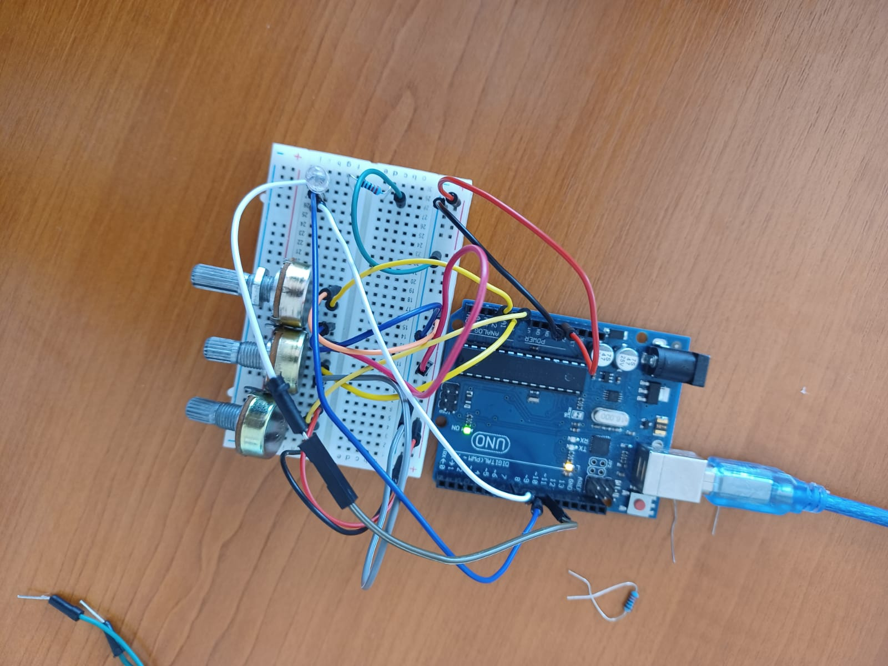
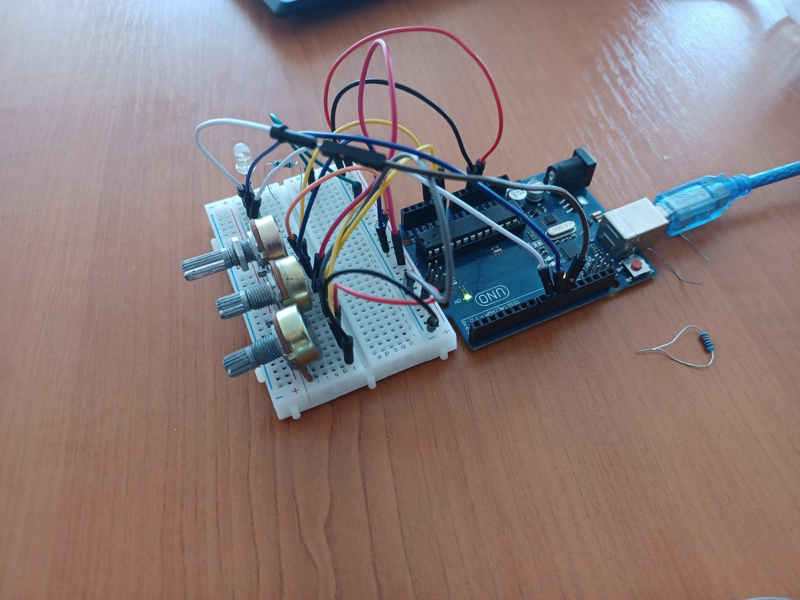
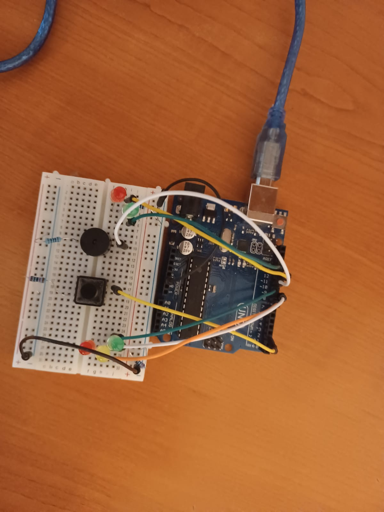

# Introduction to Robotics (2021 - 2022)

Homeworks from the "Introduction to Robotics" laboratory taken at the Faculty of Mathematics and Computer Science, University of Bucharest.

# Homework 1 - Light up an RGB led

 

## Components

* RBG led (1 minimum)
* potentiometers (3 minimum)
* resistors and wires (per logic)

## Task Requirement

Use a separat potentiometer in controlling each of the color of the RGB led (Red, Green and Blue).  The control must be done with digital electronics (you must read the value of the potentiometer with Arduino, and write a mapped value to each of the pins connected to the led).

## Setup

## Demo

https://www.youtube.com/watch?v=8zxyjhGv500

# Homework 2 - Light up an RGB led

 

## Components

* 5 LEDs
* 1 button
* 1 buzzer
* resistors and wires (per logic)

## Task Requirement

Building the traffic lights for a crosswalk.

You will use 2 LEDs to represent the traffic lights for people (red and green) and 3 LEDs to represent the traffic lights for cars (red, yellow and green).

The system has the following states:

* State 1 (default, reinstated after state 4 ends): green light for cars, red light for people, no  sounds. Duration: indefinite,  changed by pressing the button.

* State 2 (initiated by counting down 10 seconds after a button press: the light should be yellow for cars, red for people and no sounds. Duration: 3 seconds.

* State 3 (iniated after state 2 ends): red for cars, green for people and a beeping sound from the buzzer at a constant interval.  Duration: 10 seconds.

* State 4 (initiated after state 3 ends): red for cars, blinking green for people and a beeping sound from the buzzer, at a constant interval, faster than the beeping in state 3. This state should last 5 seconds. 

Be  careful: pressing the button in any state other than state 1 should NOT yield any actions.

## Setup

## Demo

https://www.youtube.com/watch?v=Hli1Vo9i5Wc

