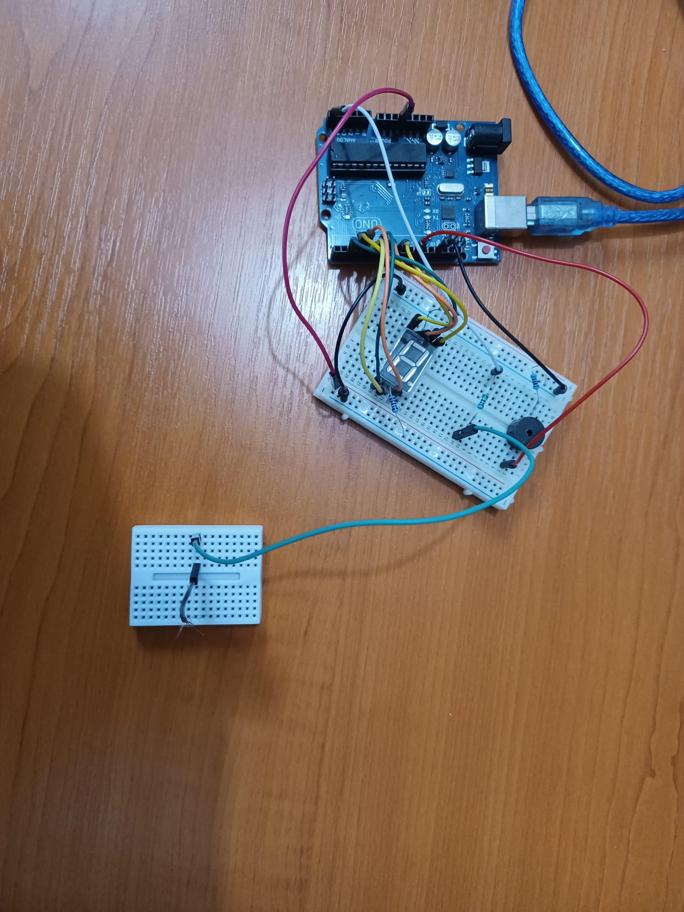
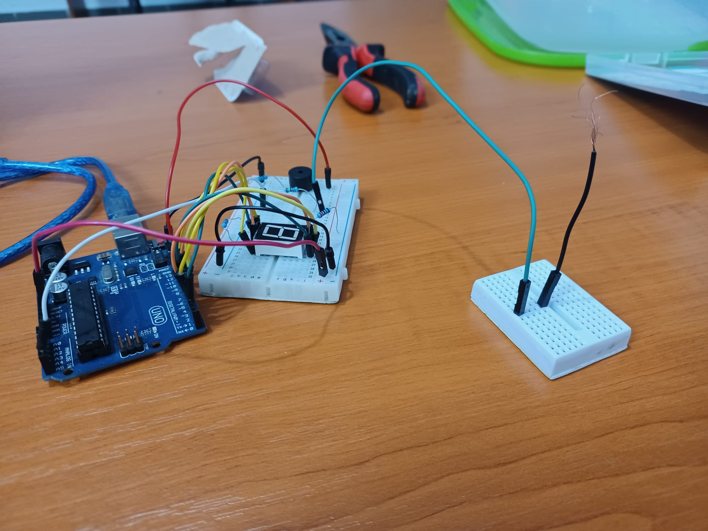
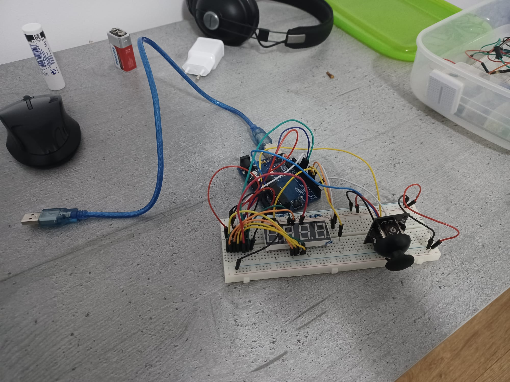
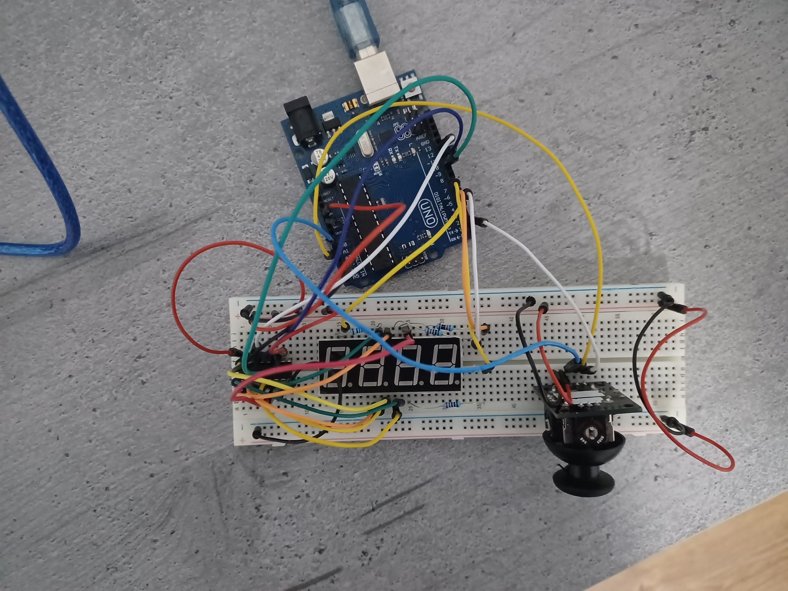

# Introduction to Robotics (2021 - 2022)

Homeworks from the "Introduction to Robotics" laboratory taken at the Faculty of Mathematics and Computer Science, University of Bucharest.

# Homework 1 - Light up an RGB led

 

## Components

* RBG led (1 minimum)
* potentiometers (3 minimum)
* resistors and wires (per logic)

## Task Requirement

Use a separat potentiometer in controlling each of the color of the RGB led (Red, Green and Blue).  The control must be done with digital electronics (you must read the value of the potentiometer with Arduino, and write a mapped value to each of the pins connected to the led).

## Setup

## Demo

https://www.youtube.com/watch?v=8zxyjhGv500

# Homework 2 - Traffic lights for a crosswalk

 

## Components

* 5 LEDs
* 1 button
* 1 buzzer
* resistors and wires (per logic)

## Task Requirement

Building the traffic lights for a crosswalk.

You will use 2 LEDs to represent the traffic lights for people (red and green) and 3 LEDs to represent the traffic lights for cars (red, yellow and green).

The system has the following states:

* State 1 (default, reinstated after state 4 ends): green light for cars, red light for people, no  sounds. Duration: indefinite,  changed by pressing the button.

* State 2 (initiated by counting down 10 seconds after a button press: the light should be yellow for cars, red for people and no sounds. Duration: 3 seconds.

* State 3 (iniated after state 2 ends): red for cars, green for people and a beeping sound from the buzzer at a constant interval.  Duration: 10 seconds.

* State 4 (initiated after state 3 ends): red for cars, blinking green for people and a beeping sound from the buzzer, at a constant interval, faster than the beeping in state 3. This state should last 5 seconds. 

Be  careful: pressing the button in any state other than state 1 should NOT yield any actions.

## Setup

## Demo

https://www.youtube.com/watch?v=Hli1Vo9i5Wc

# Homework 3 - EMF detector (Ghost detector)

 

## Components

* 1 7-segment display
* 1 antenna
* 1 buzzer
* resistors and wires (per logic)

## Task Requirement

Build a Ghost detector which is basically an EMF detector.

## Setup

## Demo

https://www.youtube.com/watch?v=cJnMEKBt7Ck

# Homework 4 - Set digits on a 4 digit 7-segment display

 

## Components

* joystick
* 4 digit 7-segment display
* 74hc595 shiftregister
* resistors and wires (per logic)

## Task Requirement

The current homework involves using a joystick in setting the values on each digit of a 4 digit 7-segment display connected to a shift register 74hc595. For maximum grade, you muse use interrupts, and for bonus you can save the last value in eeprom.

First state: you can use a joystick axis to cycle through the 4 digits; using the other axis does nothing. A blinking decimal point showsthe current digit position. When pressing the button (must use interruptfor maximum points!), you lock in on the selected digit and enter the second state.

In the second state, the decimal point stays always on, no longer blinking and you can no longer use the axis to cycle through the 4 digits. Instead, using the other axis, you can increment or decrement the number on the current digit. Pressing the button again returns you to the previous state. For bonus, save the last value in eeprom and load it when starting arduino.  Also, keep in mind that when changing the number, you mustincrement it for each joystick movement - it should not work continuosly increment if you keep the joystick in one position.

## Setup

## Demo

https://www.youtube.com/watch?v=qAyXn6Z11QE

